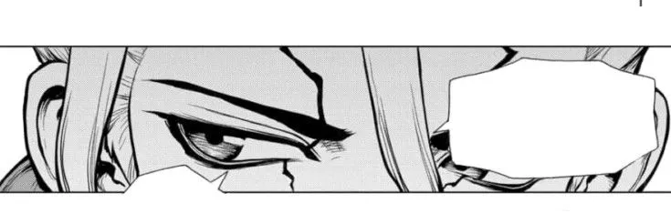

<!-- By https://github.com/DenverCoder1 -->

<h4 >Hello guys, I'm Enzo Freitas, a biotechnology undergraduate student at the Federal University of Pará (UFPA). I'm currently working hard to study languages and machine learning, and that's it, I think.</h4> 

## 🌱 About Me

- 🧠 Curious by nature, I love learning new things!
- 💻 Aspiring Full Stack Developer - just getting started and loving it!
- ⭐ Currently learning **everything** to become a complete developer.

## ☕ Current Goals

- 🎓 Learning Python and its applied libraries in Machine Learning and data processing.
- 🔬 Apply programming skills to biotechnology research.

## 🛠️ Technologies & Tools

### Connect with Me

---

  

